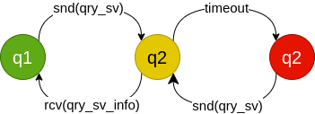

# Protocolo

> Ismael Moussaid Gómez y Adrián Morales Torrano

## Vista general del proyecto y del protocolo

En nuestro protocolo de aplicación hemos distinguido los siguientes tipos de mensajes transferidos mediante `UDP`:

ID | Nombre de mensaje | Abreviatura | Tamaño en bytes | Secciones del mensaje | Descripción
--- | --- | --- | --- | --- | ---
0 | OK | `ok` | 1 | `Tipo[1]` | Confirma el mensaje anterior y la acción del mismo.
1 | NotOK | `not_ok`| 1 | `Tipo[1]` | Confirma el mensaje anterior y deniega la acción del mismo.
2 | Registro de Servidor | `reg_sv` | 9 | `Tipo[1]`, `Protocolo[4]`, `Puerto[4]` | Un `Servidor` solicita el registro a un `Directorio`.
3 | Consula de Servidor | `qry_sv` | 5 | `Tipo[1]`, `Protocolo[4]` | Un `Cliente` consulta la dirección de `Servidor` a un `Directorio`.
4 | Respuesta de Consulta | `qry_sv_info` | 9 |`Tipo[1]`, `Direccion IPv4[4]`, `Puerto[4]` | Contiene la información del `Servidor` al que un `Cliente` debe conectarse.

> TODO: Insertar un diagrama con los tipos de mensajes entre entidades (cliente-servidor).

## Autómatas de los procesos
#### Autómata Cliente-Directorio

#### Autómata Servidor-Directorio

#### Autómata Directorio

